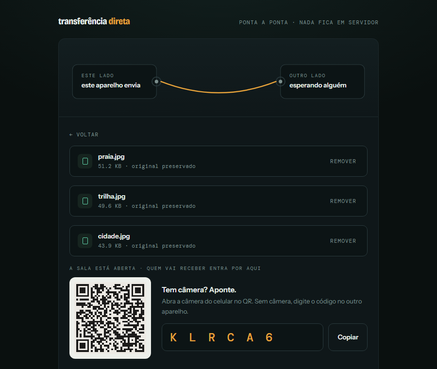
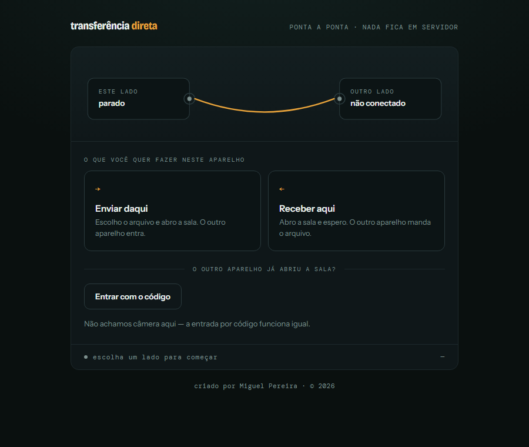
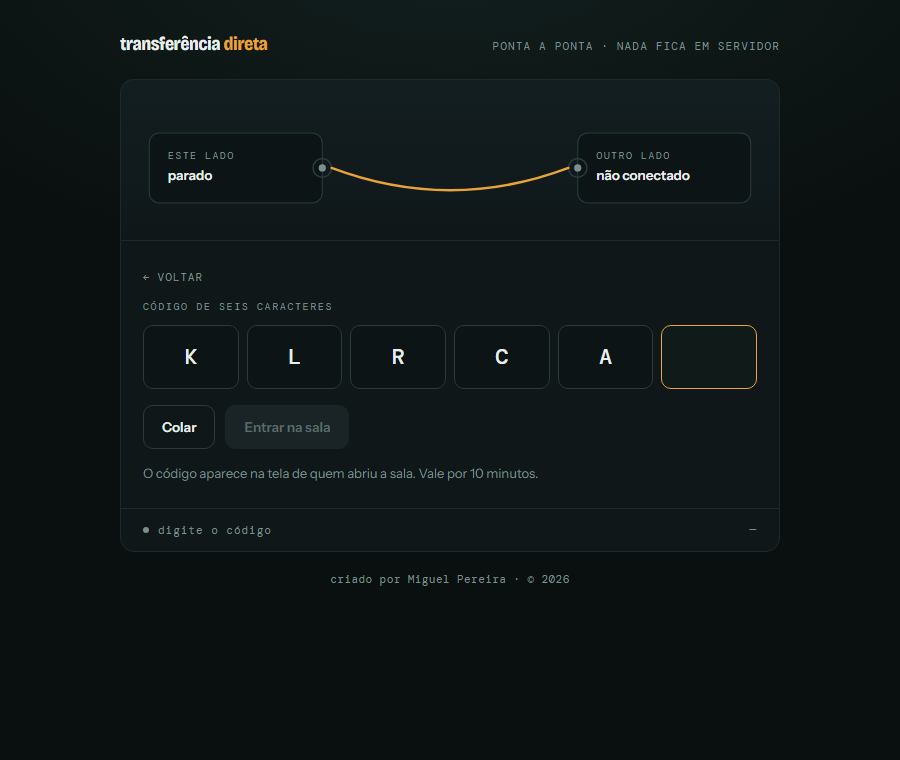
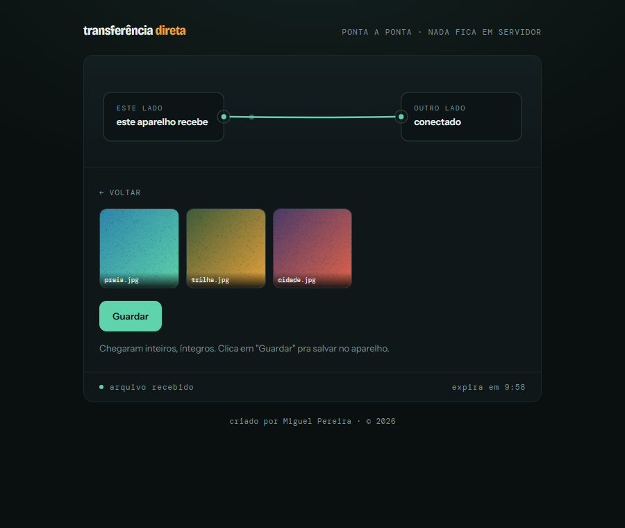
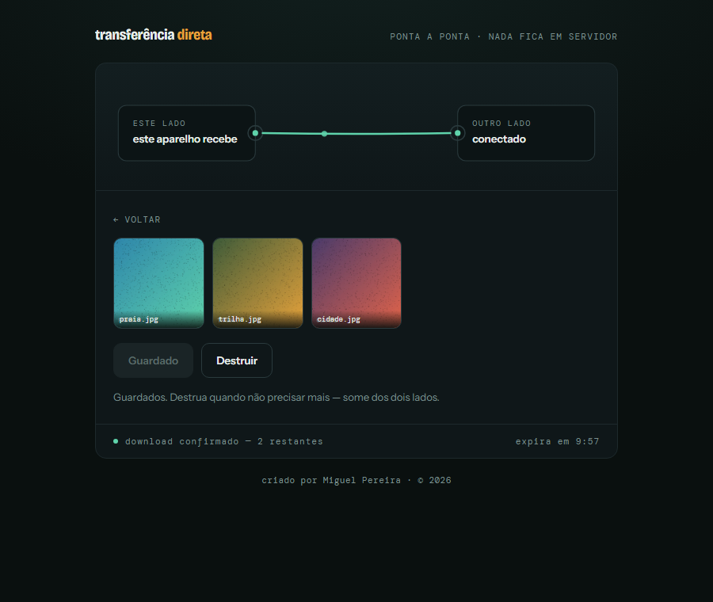
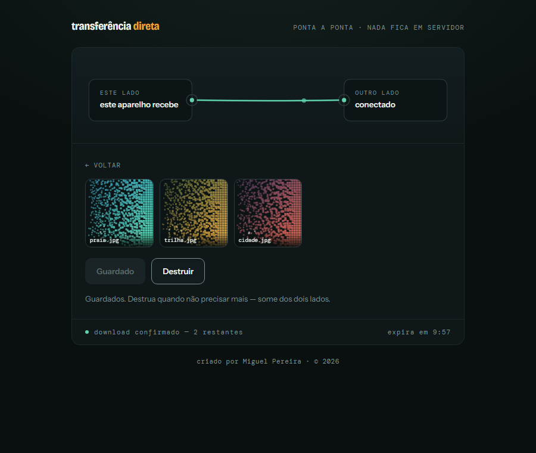
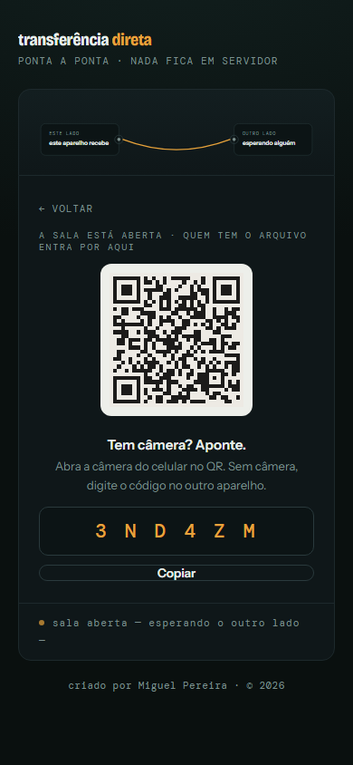

# transferência direta

**Transferência de arquivo ponta a ponta, de verdade.** Sem upload, sem conta, sem banco de dados — o arquivo nunca passa pelo meu servidor, só vai direto de um aparelho pro outro via WebRTC. Quando os dois lados terminam, a sessão é destruída e não sobra rastro em lugar nenhum.

**[🔗 Testar agora → transferencia-via-meta-dados.onrender.com](https://transferencia-via-meta-dados.onrender.com)**



## Funcionalidades

- **P2P real via WebRTC** — o servidor só troca metadado de conexão (SDP/ICE); o arquivo em si trafega direto entre os dois aparelhos, cifrado por DTLS.
- **Qualquer combinação de aparelhos** — celular↔celular, PC↔PC, celular↔PC. Quem abre a sala escolhe **enviar** ou **receber** explicitamente; não existe mais um "papel fixo por tipo de aparelho" que quebra quando os dois lados são iguais ou quando um PC não tem câmera.
- **QR e código de 6 dígitos, sempre juntos** — a mesma sala, duas formas de entrar. Sem câmera? Digita o código (alfabeto pensado pra ser ditado por telefone, sem `0/O/1/I` ambíguos).
- **Até 5 arquivos por transferência**, enviados em sequência, com grade de miniaturas no destino.
- **Integridade verificada de verdade** — hash SHA-256 calculado nas duas pontas via Web Crypto; se não bater, o arquivo é recusado, não só "aceito e torce".
- **"Guardar" explícito antes de poder destruir** — nada baixa sozinho; o botão "Destruir" só aparece depois que o outro lado confirmou o salvamento.
- **Destruição real, não só cosmética** — a animação de dissolução em partículas amostra os pixels de verdade do arquivo recebido, e ao terminar a sala é encerrada no servidor e a memória do navegador é liberada.
- **STUN + fallback TURN** para quando os dois aparelhos não estão na mesma rede.
- **Responsivo de verdade** — testado de celular estreito (320px) a desktop, sem quebra de layout.

## Capturas de tela

| | |
|---|---|
|  **1. Enviar ou receber** — escolha explícita de quem abre a sala. |  **2. Entrar por código** — sem câmera? sem problema. |
|  **3. Recebido** — grade de miniaturas, integridade já conferida. |  **4. Guardado** — só agora "Destruir" aparece. |
|  **5. Destruição real** — dissolve os pixels de verdade e encerra a sala no servidor. |  **6. Responsivo** — mesma experiência em qualquer tamanho de tela. |

## Como funciona

1. Quem abre a página escolhe um papel explícito: **enviar daqui** ou **receber aqui**. O servidor cria uma **sala** (token de 128 bits, TTL de 10min) com esse papel gravado.
2. A sala fica aberta mostrando **QR e código de 6 caracteres juntos** — duas formas da mesma coisa. Quem entra herda automaticamente o papel invertido, sem escolher nada.
3. Os dois dispositivos entram na mesma sala pelo **servidor de sinalização** (WebSocket), que troca só metadado de conexão (SDP/ICE) — nunca vê o arquivo.
4. O(s) arquivo(s) viajam direto entre os dois via `RTCDataChannel` (WebRTC), com STUN e fallback TURN quando os dispositivos não estão na mesma rede.
5. No destino, o hash SHA-256 é conferido antes de liberar qualquer coisa. Confirmado, o botão **"Guardar"** baixa tudo — só então **"Destruir agora"** aparece.
6. "Destruir agora" dispara a dissolução em partículas de cada miniatura e descarta a sessão de verdade: a sala é destruída no servidor, não é só cosmético.

## Stack técnica

- **Frontend**: JavaScript puro (ES modules), sem framework, sem build step — abre direto no navegador.
- **Backend**: Node.js com HTTP nativo + [`ws`](https://github.com/websockets/ws), sem framework web. Estado 100% em memória.
- **Transporte**: `RTCPeerConnection` / `RTCDataChannel` nativos do navegador, DTLS obrigatório.
- **QR**: geração server-side ([`qrcode`](https://github.com/soldair/node-qrcode)), leitura client-side via `BarcodeDetector` nativo com fallback [jsQR](https://github.com/cozmo/jsQR) vendorizado (sem CDN — a CSP não permite).
- **Deploy**: [Render](https://render.com), serviço único (front-end estático + backend WebSocket no mesmo processo).

## Estrutura

```
server/           servidor de sinalização (Node.js, sem framework)
  src/
    index.js       HTTP + WS entrypoint, rotas de sala/QR/código/TURN
    rooms.js        RoomManager — estado em memória, TTL, código curto, destruição
    signaling.js     relay de SDP/ICE entre os dois peers de uma sala
    security.js      origin check, rate limiter, validação de mensagem
    turn.js          emissão de credenciais TURN (efêmeras ou fixas, conforme o provedor)
web/              front-end estático (vanilla JS/HTML/CSS), página única
  index.html        as 5 telas: intenção, sala aberta, código, scanner, transferência
  assets/
    styles.css        identidade visual (paleta, tipografia, componentes)
    signaling-client.js  cliente WS fino, só metadado de conexão
    webrtc-client.js     RTCPeerConnection + troca de SDP/ICE pelo canal de sinalização
    file-transfer.js     chunking + hash SHA-256 + reconstrução do arquivo pelo RTCDataChannel
    ice-config.js         busca credenciais TURN em /api/turn-credentials, monta STUN+TURN
    dissolve.js           efeito de dissolução em partículas aplicado ao preview real
    qr-scan.js             leitura de QR pela câmera do navegador (BarcodeDetector + fallback jsQR)
    app.js                 orquestra as 5 telas, papéis, múltiplos arquivos e a conexão ponta a ponta
    vendor/jsqr.js          jsQR vendorizado localmente (sem CDN — CSP não permite)
docs/screenshots/  capturas de tela usadas neste README
preview.html      protótipo do efeito de dissolução em partículas (referência)
transferencia.html  protótipo da tela de conexão atual (referência)
SECURITY.md       modelo de ameaças e decisões de segurança do projeto
```

## Rodando localmente

```bash
cd server
npm install
npm run dev
```

Abra `http://localhost:8787`. Para testar com dois aparelhos de verdade na mesma rede Wi-Fi, troque `localhost` pelo IP local da máquina (ex: `http://192.168.0.x:8787`) e ajuste `PUBLIC_BASE_URL` e `ALLOWED_ORIGINS` no `.env` (copie de `.env.example`) para esse endereço — senão o check de origem do WebSocket rejeita a conexão. Repare que **a leitura de hash SHA-256 exige contexto seguro** (`https://` ou `localhost`) — acessar pelo IP da rede via `http://` funciona pra conectar, mas a verificação de integridade falha (com mensagem de erro clara, não trava silenciosamente).

Para testar com os dois peers em **redes diferentes** (ex: celular em dados móveis), o STUN sozinho não basta — é preciso configurar um provedor TURN no `.env` (`TURN_URLS` + `TURN_SECRET` para credenciais efêmeras, ou `TURN_STATIC_USERNAME`/`TURN_STATIC_CREDENTIAL` para provedores com credencial fixa, como o Metered.ca). Sem isso, `/api/turn-credentials` responde 204 e o client cai pra STUN-only, que só conecta quando há caminho direto entre os dois peers.

## Segurança

Resumo rápido — o detalhe completo (modelo de ameaças, por que cada decisão foi tomada) está em [SECURITY.md](SECURITY.md):

- O arquivo nunca é persistido em disco/banco em nenhum ponto do caminho, nem no servidor de sinalização, nem no relay TURN.
- Sala efêmera e de uso único: token de 128 bits, TTL de 10min sem conexão, teto de 30min conectada, destruição imediata ao terminar.
- `RTCDataChannel` usa DTLS obrigatório — cifrado ponta a ponta mesmo passando pelo relay TURN.
- Código de 6 dígitos é uma chave de busca separada e mais fraca que o servidor resolve pro token forte — não substitui o token, só facilita entrar sem câmera.
- CSP restritiva, allowlist de origem no WebSocket, rate limiting por IP, validação estrita de mensagem.

## Status

Roadmap completo, do servidor de sinalização até a tela de conexão sem papel fixo por tipo de aparelho:

1. ✅ Servidor de sinalização + sala/token + QR code
2. ✅ Conexão WebRTC entre os dois peers
3. ✅ Transferência via `RTCDataChannel` em chunks, hash SHA-256, metadados originais preservados
4. ✅ Fallback STUN/TURN para redes diferentes
5. ✅ Efeito de partículas aplicado ao arquivo real recebido + descarte real da sessão
6. ✅ Polimento visual final
7. ✅ Tela de conexão sem papel fixo por tipo de aparelho — enviar/receber explícito, QR + código, leitura de QR pela própria câmera do navegador
8. ✅ Seleção de até 5 arquivos por transferência, com "Guardar" explícito antes de liberar "Destruir"
9. ✅ Deploy em produção (Render) + layout responsivo revisado de ponta a ponta

---

Criado por **Miguel Pereira** · 2026
